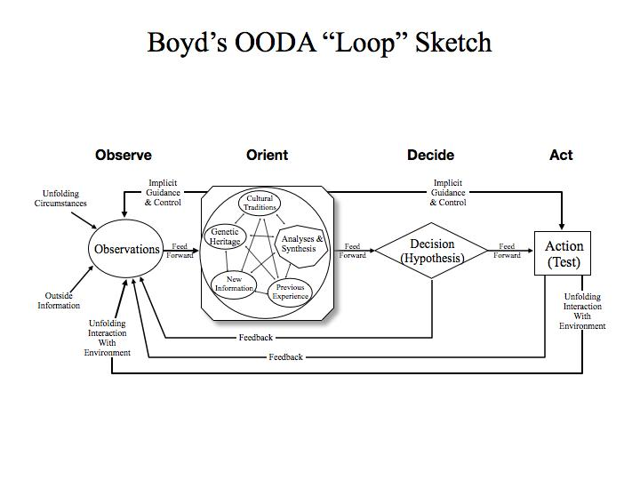

## Introduction: The Hidden Structure of Technical Decision Making

In the high-velocity world of technical program management, the difference between success and failure often hinges not on the quality of your strategy documents, but on your team's ability to rapidly sense, process, and respond to changing conditions. As technical leaders, we face a paradox: the more complex our systems become, the more we need frameworks that cut through complexity rather than add to it.

This is where Colonel John Boyd's OODA Loop framework enters the picture—not as another process to follow, but as a lens to understand the fundamental rhythm of operational decision-making.

## The Origins: From Aerial Combat to Program Management

John Boyd was a fighter pilot who became one of the most influential military strategists of the 20th century. Known as "Forty-Second Boyd" for his ability to win aerial combat engagements in less than 40 seconds, he developed his theories through direct experience in World War II, the Korean War, and Vietnam.

In the unforgiving arena of aerial combat during the Korean War, Boyd observed something counterintuitive: F-86 Sabre pilots were consistently outperforming their opponents in MiG-15s, despite the MiG's superior technical specifications. This puzzle—how pilots in technically inferior aircraft could dominate—became the catalyst for Boyd's lifelong intellectual journey.

Boyd's tactical insights transformed aerial combat from an art form into a science. While studying thermodynamics at Georgia Tech, he developed Energy-Maneuverability (E-M) Theory, recognizing that advantage came not from raw speed or power, but from the ability to rapidly "dump" and regain energy. His revolutionary work in aircraft design ultimately led to the F-16 fighter jet, demonstrating his ability to translate theoretical insights into practical applications.

This approach to solving complex problems—combining deep observation, cross-disciplinary thinking, and practical implementation—led to his most enduring contribution: the OODA Loop (Observe, Orient, Decide, Act).

The OODA loop was originally developed for combat operations but has since been applied to understand commercial operations across many contexts. What makes this framework so powerful for technical program management is its focus on tempo and adaptation rather than rigid planning—exactly the qualities needed to navigate the uncertainty of complex technical programs.

## Beyond the Simplified Loop: Understanding Boyd's Full Model

The common representation of the OODA Loop as a simple circular process does a disservice to Boyd's actual conception. As military strategist Colin Gray noted, Boyd's sophisticated diagram has an "elegant simplicity, with an extensive domain of applicability and contains a high quality of insight about strategic essentials", but it's far more nuanced than most realize.

Boyd never described the OODA Loop in a technical paper. Instead, he developed and explained it through extensive briefings, sometimes lasting five hours, combining military strategy with insights from quantum mechanics, cybernetics, chaos theory, Popperism, and Neo-Darwinism. His only written work, a 1976 essay titled "Destruction and Creation," provides the philosophical foundation for the OODA Loop by integrating Gödel's Incompleteness Theorem, Heisenberg's Uncertainty Principle, and the Second Law of Thermodynamics.

What many don't realize is that Boyd's actual OODA diagram, drawn in 1996 during his "Winning and Losing" presentation, is the only visual representation he ever created—and it looks nothing like the simplified circular model most people know. His full model incorporates multiple feedback loops, mental models, cultural traditions, and genetic heritage as components of the orientation phase—the cognitive engine that powers the entire decision cycle.

For technical program managers, this more complete understanding reveals why simply "speeding up the loop" often fails to deliver better outcomes. Let's explore how each component applies to the TPM context.

## Observe: The Art of Technical Signal Detection

In Boyd's framework, observation is not passive reception but active sensing—attuning yourself to meaningful signals amid the noise. For TPMs, this means systematically gathering data while maintaining awareness of what might be missing.

### Pitfalls in Technical Observation:

* **Data without context**: Tracking commit histories, test passes, and velocity metrics without understanding their significance
* **Narrative drought**: Engineers unable or unwilling to provide the qualitative story behind the numbers
* **Dependency blindness**: Failing to detect changes in adjacent teams or systems that will impact your program
* **Signal overwhelm**: Drowning in dashboards, alerts, and status updates without discerning patterns

### Interventions for Better Observation:

* **Structured status mechanisms**: Daily updates or standups designed to surface both progress and impediments
* **Technical telemetry**: Automated systems that provide objective measures of system health and development progress
* **Dependency mapping**: Regular touchpoints with adjacent teams and systems
* **Strategic silence**: Creating space to notice what isn't being reported or discussed

The observation phase for TPMs isn't about collecting more data—it's about curating meaningful signals. A program manager drowning in metrics but missing the engineer's growing frustration with a third-party dependency is observing poorly, regardless of how many dashboards they monitor.

## Orient: The Cognitive Engine of Program Management

Orientation is the most critical and least understood part of Boyd's framework. Boyd considered it the "schwerpunkt" (focal point) of the entire OODA process. This is the element where competitive advantage is truly created or lost. It's not just about processing what you've observed, it's about framing those observations through your mental models, organizational stories, previous experiences, and even cultural heritage.

As Boyd explained, without our traditions and experiences, "we do not possess an implicit repertoire of psycho-physical skills shaped by environments and changes that we have previously experienced." This insight is particularly relevant for program managers, who must constantly interpret signals through the lens of organizational history and technical context.

### Pitfalls in Technical Orientation:

* **Lack of organizational history**: No institutional memory of successful delivery patterns
* **Methodological dogmatism**: Overfitting program methodologies (rigid Scrum, SAFe, etc.) regardless of context
* **Technical blind spots**: Program managers lacking sufficient technical depth to interpret engineering signals
* **Cultural misalignment**: Disconnects between teams (hardware, firmware, backend, application) and stakeholders (leadership, dependencies, sales) perceive program health

### Interventions for Better Orientation:

* **Playbook development**: Documenting successful project patterns with context-specific learnings
* **Knowledge networks**: Creating communities of practice that preserve institutional wisdom
* **Technical upskilling**: Ensuring program leaders have enough technical context to form accurate mental models (and technical leaders have enough business context to make good decisions)
* **Cultural navigation tools**: Explicit mapping of how different stakeholders define and perceive success

For TPMs, orientation means developing the "fingerspitzengefühl" (intuitive grasp) that lets you sense when a project is truly healthy versus merely reporting green. It's the ability to recognize patterns before they become problems, and it's built through both technical depth and organizational awareness.

## Decide: From Deliberation to Direction

Decision-making in Boyd's framework isn't just about making choices—it's about creating direction amid uncertainty. For TPMs, this means translating the team's collective intelligence into actionable paths forward.

### Pitfalls in Technical Decision-Making:

* **Decision theater**: Performances of decisiveness without actual commitment
* **Factional fragmentation**: Unresolved conflicts that prevent unified execution
* **Transparency gaps**: Decisions taken but poorly communicated, leading to team confusion
* **Decision paralysis**: Analysis and debate without closure, leaving teams stalled and confused

### Interventions for Better Decisions:

* **Decision protocols**: Clear processes for who decides what, when, and how
* **Disagree and commit mechanisms**: Structured ways to surface objections while maintaining momentum
* **Communication architecture**: Clean broadcasting channels for major decisions
* **Decision documents**: Lightweight artifacts that capture context, options considered, and rationale

The decide phase is about ensuring that decisions get made, documented, and disseminated with speed and clarity. The best TPMs don't centralize decisions; they create the conditions for timely, quality decisions to emerge from the right parts of the organization.

## Act: Execution as a Learning System

The final phase of Boyd's loop focuses on translating decisions into action—not as the end of the process, but as the beginning of the next cycle of learning. For TPMs, action isn't just about delivery; it's about creating executable vectors that generate new observations.

### Pitfalls in Technical Execution:

* **Execution opacity**: Poor visibility into implementation causing trust erosion
* **Technical-leadership divide**: Leadership lack of technical understanding creating churn and micromanagement
* **Skill discontinuities**: Unaddressed capability gaps slowing implementation
* **Feedback deserts**: Actions without mechanisms to observe their effects

### Interventions for Better Action:

* **Transparent progress mechanisms**: Clear, consistent status reporting that builds trust
* **Technical narrative skills**: Helping engineers communicate complex implementation details effectively
* **Capability mapping**: Identifying and addressing skill gaps before they become execution bottlenecks
* **Learning structures**: Retrospectives and reviews that convert action into observation

The action phase closes the loop by generating new signals to observe. For TPMs, this means creating execution paths that not only deliver value but also produce the feedback needed to adapt and evolve.

## Operating Inside the Opponent's Loop: Competitive Advantage

Boyd's conception of war as a "violent and time-competitive clash to disrupt an adversary's mind and force cohesion" has influenced modern military doctrine and strategic thinking. In the context of technical product development, your "adversary" might be the market, internal factions, technical debt, or even the current known laws of physics.

By improving your team's OODA cycle, you gain the ability to:

1. **Detect market shifts before competitors**
2. **Interpret technical trends more accurately**
3. **Make more coherent decisions under pressure**
4. **Execute with greater precision and adaptability**

This creates a compounding advantage—each cycle through the loop improves your position for the next iteration, while competitors struggle to make sense of a landscape you're helping to shape.

## Implementing OODA in Your Technical Organization

Adopting an OODA-based approach to technical program management doesn't require new tools or reorganizations. Instead, it means:

1. **Refocusing observation systems** on meaningful signals rather than comforting metrics
2. **Investing in orientation capabilities** through technical context and institutional knowledge
3. **Streamlining decision architectures** to eliminate unnecessary friction
4. **Creating action systems** that generate rich feedback

The beauty of the OODA framework is that it can be applied at any level of the organization—from individual engineers making technical decisions to executives navigating strategic pivots. By creating a shared language for the decision cycle, you enable faster coordination and adaptation throughout the system.

## Beyond the Loop: Strategic Implications

When moving from tactical execution to strategic thinking, Boyd put less emphasis on fast OODA Looping and instead focused on developing the best mental concepts to win the long game. This distinction is crucial for technical leaders. At the strategic level, it's less about cycling through decisions quickly and more about deeply understanding the right problem and generating sound solutions.

Boyd's approach at the strategic level incorporates what he called the "dialectic engine" of destruction and creation. In his view, innovation requires breaking down existing mental models (destruction) before new ones can be formed (creation). This means being willing to challenge established methodologies when they no longer serve the core mission.

The best programs maintain tempo at the execution level while ensuring strategic coherence. This dual-rhythm approach of fast operational cycles within stable strategic frameworks provides both the adaptability to respond to change and the coherence to build complex systems. As Boyd would emphasize, the goal isn't just to move through the OODA cycle faster, but to increase the "tempo" of operations. 

## Conclusion: The Tempo Advantage

In an industry obsessed with methodologies and processes, the OODA Loop offers something different: a lens for understanding the fundamental rhythm of effective decision-making. It's not another framework to implement, but a way of seeing how observation, orientation, decision, and action flow together in successful technical organizations.

As Boyd advised throughout his career, we shouldn't be dogmatic about any approach. The OODA framework is adaptable to various situations and contexts, from tactical engineering decisions to strategic product positioning. The power lies not in rigid application but in recognizing that all teams are "doing OODA" whether they know it or not. You might as well practice it deliberately.

A key insight from Boyd's work is that no single person needs to carry the entire cognitive load. The concept of "fingerspitzengefühl" (fingertip feel)—the intuitive grasp that enables rapid decision-making—often resides collectively within a multidisciplinary team with diverse skills and perspectives. For technical programs, this means creating the conditions where this collective intelligence can flourish, primarily through efficient, fast, and candid communications.

As you navigate your next technical program, consider not just what you're building, but how your team observes, orients, decides, and acts. The quality of those loops—their speed, coherence, and learning capacity—may be the most important meta-process you manage.

The technical leader who masters this rhythm gains what Boyd called "operating inside the opponent's OODA Loop"—the ability to adapt and evolve faster than the problems you face. In the accelerating landscape of technology, there may be no greater competitive advantage.
